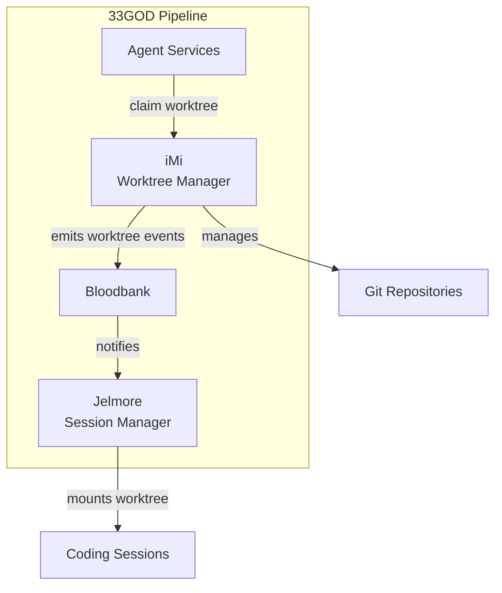

# iMi - GOD Document

> **Guaranteed Organizational Document** - Developer-facing reference for iMi
>
> **Last Updated**: 2026-02-01
> **Domain**: Workspace Management
> **Status**: Production

---

## Product Overview

**iMi** (pronounced "eye-me") is a decentralized git worktree manager that provides **entity-based workspace isolation** for multi-agent development. Each entity (human or AI agent) gets a completely isolated workspace directory with full project clones, enabling true parallel development without worktree conflicts.

**Key Capabilities:**
- Entity-based workspace isolation (`~/.imi/workspaces/{entity_id}/`)
- Token-based authentication (`$IMI_IDENTITY_TOKEN`) for humans and agents
- Worktree lifecycle management (add, claim, release, merge)
- Project registry with UUIDs for cross-component reference
- Bloodbank event emission for worktree state changes

---

## Architecture Position



**Role in Pipeline**: Provides isolated git worktrees with agent claiming semantics, enabling parallel multi-agent development on the same repository.

---

## Event Contracts

### Bloodbank Events Emitted

| Event Name | Routing Key | Payload Schema | Trigger Condition |
|------------|-------------|----------------|-------------------|
| `imi.worktree.created` | `imi.worktree.created` | `WorktreeCreatedPayload` | `imi add feat <name>` executed |
| `imi.worktree.claimed` | `imi.worktree.claimed` | `WorktreeClaimedPayload` | Agent/entity claims worktree |
| `imi.worktree.released` | `imi.worktree.released` | `WorktreeReleasedPayload` | Work completed, worktree released |
| `imi.worktree.merged` | `imi.worktree.merged` | `WorktreeMergedPayload` | PR merged, worktree deleted |
| `imi.project.registered` | `imi.project.registered` | `ProjectRegisteredPayload` | New project added to registry |

**Payload Schemas** (defined in `holyfields/schemas/imi/`):

```json
// WorktreeCreatedPayload
{
  "project_uuid": "uuid",
  "worktree_name": "feat-authentication",
  "worktree_type": "feat|fix|exp",
  "base_branch": "main",
  "created_by": "entity_id",
  "timestamp": "datetime"
}
```

### Bloodbank Events Consumed

| Event Name | Routing Key | Handler | Purpose |
|------------|-------------|---------|---------|
| `agent.task.assigned` | `agent.task.#` | `auto_claim_worktree()` | Auto-claim worktree when agent receives task |
| `agent.task.completed` | `agent.task.#` | `auto_release_worktree()` | Auto-release worktree when task completes |

---

## Non-Event Interfaces

### CLI Interface

```bash
# Project Management
imi init <git-url>                    # Register new project
imi list                              # List all registered projects
imi projects                          # Show project details

# Worktree Management
imi add feat <name>                   # Create feature worktree
imi add fix <name>                    # Create bugfix worktree
imi add exp <name>                    # Create experimental worktree

# Entity Operations
imi claim <worktree>                  # Claim worktree for current entity
imi claim <worktree> --agent <id>    # Claim worktree for agent
imi release <worktree>                # Release worktree claim

# Status & Inspection
imi status                            # Show all worktrees and claims
imi show <worktree>                   # Show worktree details
imi workspace                         # Show current entity's workspace path

# Cleanup
imi prune                             # Remove merged worktrees
imi gc                                # Garbage collect old claims
```

**Commands:**

| Command | Description | Example |
|---------|-------------|---------|
| `imi init <url>` | Register new project | `imi init git@github.com:user/repo.git` |
| `imi add feat <name>` | Create feature worktree | `imi add feat authentication` |
| `imi claim <wt>` | Claim worktree | `imi claim feat-authentication` |
| `imi release <wt>` | Release worktree | `imi release feat-authentication` |
| `imi status` | Show worktree status | `imi status` |
| `imi workspace` | Show workspace path | `imi workspace` |

### API Interface

_No API interface (CLI-only tool)_

---

## Technical Deep-Dive

### Technology Stack
- **Language**: Rust 1.75+
- **Framework**: Tokio (async runtime), Clap (CLI)
- **Dependencies**:
  - `git2`: Git operations
  - `sqlx`: SQLite database
  - `serde`: Serialization
  - `tokio`: Async runtime
  - `uuid`: Project UUIDs

### Architecture Pattern

**Entity-Based Workspace Isolation:**

```
/home/delorenj/.imi/
├── registry.db                       # SQLite registry (projects, entities)
└── workspaces/
    ├── {human-entity-id}/
    │   └── {project-uuid}/
    │       ├── trunk-main/           # Main branch worktree
    │       ├── feat-auth/            # Feature worktree
    │       └── feat-dashboard/       # Feature worktree
    └── {agent-entity-id}/
        └── {project-uuid}/
            ├── trunk-main/
            └── feat-api/
```

**Key Design Decisions:**
- Each entity has completely isolated workspace directory
- No shared worktrees between entities
- Authentication via `$IMI_IDENTITY_TOKEN` (same for humans and agents)
- Project registry uses UUIDs for stable cross-component reference

### Key Implementation Details

**Worktree Claiming:**
```rust
// Claim worktree for entity
async fn claim_worktree(
    worktree_name: &str,
    entity_id: &str,
    project_uuid: Uuid
) -> Result<(), Error> {
    // Check if already claimed
    if let Some(current_claim) = get_claim(worktree_name).await? {
        return Err(Error::AlreadyClaimed(current_claim.entity_id));
    }

    // Create claim record
    insert_claim(worktree_name, entity_id, project_uuid).await?;

    // Emit event
    emit_event("imi.worktree.claimed", WorktreeClaimedPayload {
        worktree_name: worktree_name.to_string(),
        entity_id: entity_id.to_string(),
        project_uuid,
        claimed_at: Utc::now(),
    }).await?;

    Ok(())
}
```

**Workspace Path Resolution:**
```rust
fn get_workspace_path(entity_id: &str, project_uuid: Uuid) -> PathBuf {
    let imi_home = env::var("IMI_HOME")
        .unwrap_or_else(|_| format!("{}/.imi", env::var("HOME").unwrap()));

    PathBuf::from(imi_home)
        .join("workspaces")
        .join(entity_id)
        .join(project_uuid.to_string())
}
```

### Data Models

**SQLite Schema:**

```sql
CREATE TABLE projects (
    uuid TEXT PRIMARY KEY,
    name TEXT NOT NULL,
    git_url TEXT NOT NULL,
    base_branch TEXT DEFAULT 'main',
    created_at DATETIME DEFAULT CURRENT_TIMESTAMP
);

CREATE TABLE entities (
    id TEXT PRIMARY KEY,
    entity_type TEXT NOT NULL,  -- 'human' or 'agent'
    token_hash TEXT NOT NULL,   -- bcrypt hash of $IMI_IDENTITY_TOKEN
    created_at DATETIME DEFAULT CURRENT_TIMESTAMP
);

CREATE TABLE worktrees (
    id INTEGER PRIMARY KEY AUTOINCREMENT,
    project_uuid TEXT NOT NULL,
    worktree_name TEXT NOT NULL,
    worktree_type TEXT NOT NULL,  -- 'feat', 'fix', 'exp'
    worktree_path TEXT NOT NULL,
    base_branch TEXT NOT NULL,
    created_by TEXT NOT NULL,
    created_at DATETIME DEFAULT CURRENT_TIMESTAMP,
    FOREIGN KEY (project_uuid) REFERENCES projects(uuid),
    FOREIGN KEY (created_by) REFERENCES entities(id)
);

CREATE TABLE claims (
    id INTEGER PRIMARY KEY AUTOINCREMENT,
    worktree_id INTEGER NOT NULL,
    entity_id TEXT NOT NULL,
    claimed_at DATETIME DEFAULT CURRENT_TIMESTAMP,
    released_at DATETIME,
    FOREIGN KEY (worktree_id) REFERENCES worktrees(id),
    FOREIGN KEY (entity_id) REFERENCES entities(id)
);
```

### Configuration

**Environment Variables:**

- `$IMI_IDENTITY_TOKEN`: Authentication token for entity access
- `$IMI_HOME`: iMi data directory (default: `~/.imi`)
- `$BLOODBANK_URL`: Bloodbank AMQP connection (for event emission)

**Config File** (`~/.imi/config.toml`):

```toml
[imi]
home = "/home/delorenj/.imi"
default_base_branch = "main"

[bloodbank]
url = "amqp://localhost:5672"
exchange = "bloodbank.events"

[entity]
auto_claim_on_checkout = true
auto_release_on_merge = true
```

---

## Development

### Setup
```bash
# Clone iMi repository
git clone git@github.com:delorenj/iMi.git
cd iMi

# Build
cargo build --release

# Install
cargo install --path .

# Initialize iMi
imi init git@github.com:delorenj/33GOD.git
```

### Running Locally
```bash
# Set identity token
export IMI_IDENTITY_TOKEN="your-entity-token"

# Create worktree
imi add feat authentication

# Claim worktree
imi claim feat-authentication

# Work in worktree
cd ~/.imi/workspaces/$(whoami)/33god-uuid/feat-authentication

# Release when done
imi release feat-authentication
```

### Testing
```bash
# Unit tests
cargo test

# Integration tests (requires git repository)
cargo test --test integration -- --test-threads=1

# Test with mock Bloodbank
BLOODBANK_URL="amqp://mock:5672" cargo test
```

---

## Deployment

**Installation:**

```bash
# Install from crates.io
cargo install imi

# Or build from source
git clone git@github.com:delorenj/iMi.git
cd iMi
cargo build --release
cp target/release/imi ~/.local/bin/
```

**System Requirements:**
- Rust 1.75+
- Git 2.30+
- SQLite 3.35+
- RabbitMQ (for Bloodbank events)

**Authentication Setup:**

```bash
# Generate entity token
imi auth generate-token --entity-id $(whoami)

# Set in shell profile
echo 'export IMI_IDENTITY_TOKEN="<token>"' >> ~/.zshrc
```

---

## References

- **Domain Doc**: `docs/domains/workspace-management/GOD.md`
- **System Doc**: `docs/GOD.md`
- **Source**: `iMi/trunk-main/`
- **Event Schemas**: `holyfields/schemas/imi/`
